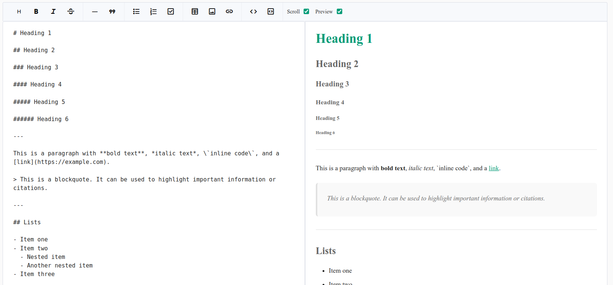

# 📝 Plusify Markdown Editor

A lightweight, extensible, and user-friendly **Markdown Editor** built with Angular. It features a custom toolbar, live preview, support for KaTeX, copy to clipboard, and interactive popovers for inserting images, links, and headings.



## ✨ Features

- 🧩 Modular architecture with reusable components.
- 🖋️ Markdown input with syntax helpers (bold, italic, lists, etc.).
- 🖼️ Insert links and images through popovers.
- 🔢 Select heading levels with a quick menu.
- 🔄 Synchronized scrolling (optional).
- 👀 Live preview powered by [`ngx-markdown`](https://github.com/jfcere/ngx-markdown) and KaTeX.
- 🎨 Customizable theme with CSS variables.

---

## 🚀 Getting Started

### 1. Install Dependencies

```bash
npm install ngx-markdown katex clipboard
```

### 2. Usage in your Component

```html
<plusify-markdown-editor
  [config]="config"
  [customTheme]="{ '--color-primary': '#4caf50' }"
  (valueChange)="handleValueChange($event)">
  </plusify-markdown-editor>
```

```typescript
config: MarkdownEditorConfig = {
   showPreview: false,
   height: '500px',
   value: '# Hello World',
   readonly: false,
};

handleValueChange(newValue: string) {
  console.log('Updated Markdown:', newValue);
}
```

---

## 🧱 Components Overview

### 📄 `<plusify-markdown-editor>`

The main editor wrapper. Provides toolbar, textarea, and live preview.

| Input         | Type                     | Description                         |
| ------------- | ------------------------ | ----------------------------------- |
| `themeClass`  | `string`                 | Optional theme class.               |
| `customTheme` | `Record<string, string>` | CSS variable overrides.             |
| `config`      | `MarkdownEditorConfig`   | Initial config options.             |

---

## 🎨 Theming

Customize using CSS variables:

```css
:root {
  --color-primary: #009b77;
  --color-on-primary: #fff;
  --color-outline: #ccc;
  --color-on-surface: #222;
}
```

Or override directly:

```html
<plusify-markdown-editor
  [customTheme]="{ '--color-primary': '#4caf50' }">
</plusify-markdown-editor>
```

---

## 📦 Dependencies

- [Angular](https://angular.dev/)
- [ngx-markdown](https://github.com/jfcere/ngx-markdown)
- [KaTeX](https://katex.org/)
- [clipboard](https://clipboardjs.com/)

---

## 🙌 Contributing

Pull requests are welcome! If you want to add new features or improve the existing ones, feel free to fork the project and submit a PR.
